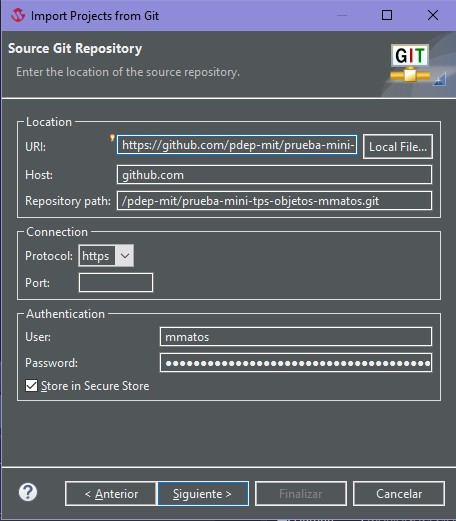
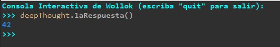
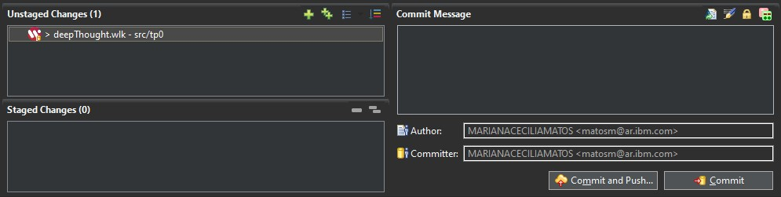
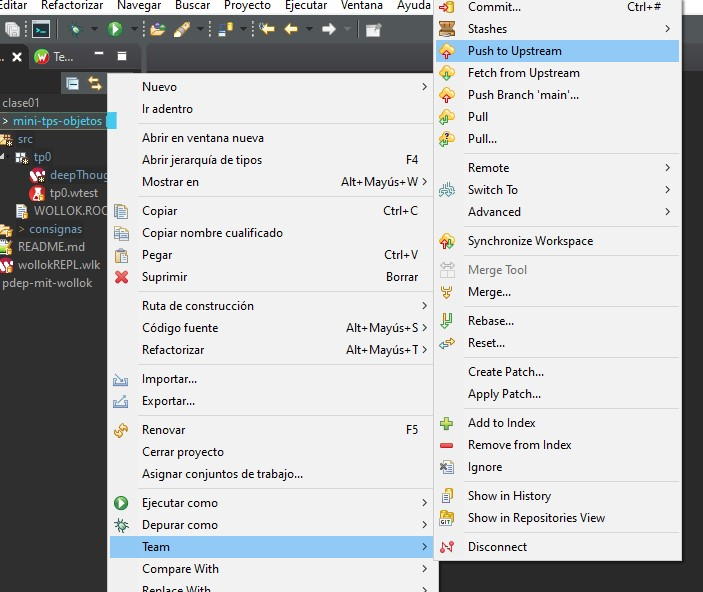

# Consigna TP0

## Objetivos

- :wrench: Que empieces a conocer algunas de las herramientas que vamos a estar usando durante la cursada, asegurando que te funcionen antes de que que sigamos avanzando con la práctica del paradigma orientado a objetos.
- :arrows_counterclockwise: Seguir usando la ejecución de pruebas automáticas como parte del flujo de trabajo, para asegurar que la solución propuesta cumpla con la funcionalidad esperada.
- :warning: Usar un entorno de desarrollo que te ayude a detectar y resolver problemas de forma temprana.
- :cloud: Usar un repositorio de código donde puedas subir tus cambios todas las veces que quieras, para que tus tutores puedan verlos y dejarte comentarios, así como también mantener un historial de lo que fuiste haciendo, sin miedo a perder tu trabajo.

> Tené en cuenta que las pruebas automáticas no se van a correr solamente en tu máquina, también se van a correr en un servidor luego de etiquetar el commit de entrega. La herramienta que se encargará de correr las pruebas, dejando los resultados disponibles para que tus tutores puedan verlos, se llama **GitHub Actions**.

## Parte 1: Preparar y probar tu entorno

### Primeros pasos  :hatching_chick:

1. Seguí las instrucciones para instalar Wollok que se encuentran en la página oficial: https://www.wollok.org/instalacion/

   :warning: Atención! Es importante instalar la versión de la JDK adecuada para asegurar que el entorno de desarrollo funcione correctamente.
  
   Luego podés seguir los pasos para bajar el entorno Wollok localmente con la opción que corresponda para tu sistema operativo. Una vez que descomprimas el archivo descargado vas a encontrar allí el ejecutable de Wollok. Al ejecutarlo se va a abrir el entorno de desarrollo.

   > :bulb: En caso de que no puedas levantar correctamente el entorno, la página de instalación incluye una recopilación de problemas frecuentes que puede que te sirvan.

2. Importá este proyecto en el entorno de desarrollo usando las opciones:

   - Archivo -> Importar...
   - Elegí la opción para importar proyectos desde GIT (con smart import)

      

   - Seleccioná Clone URI

      

   - Copiá la dirección para clonar tu repo que se obtiene de GitHub en el campo URI:

      

      > Para la autenticación de tu usuario de GitHub, usá un [token personal](https://docs.github.com/es/github/authenticating-to-github/keeping-your-account-and-data-secure/creating-a-personal-access-token) que tenga acceso de **repo**.
      >
      > Si estás usando tu computadora personal, podés tildar la opción Store in Secure Store, para que no te lo vuelva a pedir.

   - Seguí los pasos que quedan hasta finalizar, luego de lo cual te aparecerá el proyecto importado en la solapa **Explorador de paquetes**.

3. Una vez que tengas tu proyecto en el IDE, corré las pruebas del TP0 (al tener más de un TP en el mismo proyecto podés elegir correr **todas** las pruebas, sólo las del trabajo que te interese, o sólo las de un archivo de pruebas).

   - Para correr los tests del TP0, seleccioná el archivo `src/tp0/tp0.wtest` y usá la opción **Ejecutar como -> Ejecutar Tests de Wollok**.
   
      O directamente seleccioná la carpeta `src/tp0` y usá la opción **Ejecutar como -> Ejecutar todos los Tests de Wollok desde este punto**.

   - Para correr todos los tests del proyecto (múltiples TPs), seleccioná la raíz del proyecto o la carpeta `src` y usá la opción **Ejecutar como -> Ejecutar todos los Tests de Wollok desde este punto**.

   Asegurate de que el test del TP0 **falle**, ya que todavía no se implementó lo necesario en el archivo `src/tp0/deepThought.wlk` para que pase.

   Debería mostrarse el resultado de haber corrido las pruebas, incluyendo algo como esto:

   

   al seleccionar un test fallido vas a ver algunos detalles sobre qué fue lo que no funcionó como se esperaba.

   > :mag: Además si abrís el archivo `src/tp0/tp0.wtest` deberías ver un warning de este estilo: `Sistema de tipos: Se esperaba <<Number>> pero se encontró <<String>>`.
   > Ese es el sistema de tipos de Wollok, que infiere información de tipos a partir de tu código para ayudarte a detectar potenciales problemas de forma temprana. :wink:

### Trabajando con Wollok  :muscle:

1. En el archivo `src/tp0/deepThought.wlk` cambiá el string `"???"` que retorna el método `laRespuesta()` por la expresión `1 / 0`, guardá los cambios y volvé a correr los tests.

   Deberías ver que el resultado de las pruebas todavía no es exitoso, en este caso debería mostrarse como un **error** porque se ejecutó una división por cero.

   

   > :mag: En el detalle del error vas a encontrar un **stacktrace** que muestra dónde ocurrió el problema. Si clickeás en los links te va a llevar a la línea correspondiente del archivo donde ocurrió el error.

2. Volvé a cambiar el valor retornado por `laRespuesta()`, esta vez usando el número `42`, guardá y volvé a correr los tests. Confirmá que el test del TP0 ahora sí pasa :tada:

   

3. Para probar tu solución usando la consola de Wollok (REPL), sobre el archivo `src/tp0/deepThought.wlk` usá la opción **Ejecutar como -> Launch with Repl**, o usá el siguiente botón teniendo el archivo visible en el editor:

   

   Podés mandarle mensajes al objeto `deepThought` de esta forma:

   

   > :bulb: Vas a ver que al ejecutar tu programa en el Repl automáticamente se va a mostrar el estado del programa en la vista del Diagrama Dinámico.
   >
   > 
   >
   > Para este TP no va a ser especialmente interesante (habiendo un solo objeto sin estado interno), pero puede serte de gran utilidad para los próximos trabajos :grin:

## Parte 2: Subir tus cambios a GitHub

Al igual que en los otros trabajos, deberías subir tu solución a GitHub. En vez de usar la terminal del sistema operativo (o gitbash), recomendamos usar las opciones disponibles dentro del IDE de Wollok.

Para que se muestre el panel para simplificar el uso de las opciones que se necesitan con más frecuencia (add + commit y push), abrí la vista de Git Staging como se muestra a continuación:

   

   

Te va a aparecer una nueva vista en tu entorno como la siguiente:

   

  > :warning: En caso de modificar los archivos del proyecto por afuera del editor de Wollok, teniendo a su vez Wollok abierto, asegurate de seleccionar la raíz del proyecto y refrescarlo (con la opción que se encuentra dentro del menú **Archivo -> Renovar** o directamente con F5).

----

Ahora sí, a subir los cambios!

1. Luego de hacer cambios dentro de tu proyecto, debería aparecer la lista de archivos modificados desde tu último commit en el panel **Unstaged changes**. Para agregar todos tus cambios a lo que será tu siguiente commit (equivalente al comando `git add .`), usá esta opción:

   

   Luego de agregarlos, los archivos modificados van a moverse a la lista de abajo (**Staged changes**), indicando que esos archivos se incluirán en el siguiente commit.

   

2. **Commitear** tus cambios con un mensaje representativo **y pushearlos** al repo remoto:

   

   > :warning: Atención: si usás la opción Commit tus cambios no van a subirse al repositorio GitHub (sólo impacta al repo local), con lo cual tendrías que usar otra opción separada para pushear que se encuentra en otro menú con todas las opciones para trabajar con tu repositorio (o alternativamente pushear desde una terminal). Asegurate de usar la opción que combina ambas operaciones para simplificarte el trabajo.

Finalmente vas a ver una confirmación de la operación, que te informará si se subió correctamente.

Ya sabés que podés subir tu solución tantas veces como quieras. **Es recomendable hacer commits chicos y frecuentes**, en vez de un solo gran commit con todo lo que se pedía resolver.

----

Los motivos comunes por los cuales podría fallar el push son:
  - falta de conexión a internet,
  - no tener algún commit del repositorio remoto que se haya hecho desde otro lado (ej. actualizaciones al README hechas a mano desde la página de GitHub) y faltó hacer pull para actualizar tu repositorio local.

En caso de que lo necesites, ya sea si falló al subirse con la opción de Commit and Push, o por haber usado la opción de Commit a secas, podés pushear más adelante dando click derecho en el proyecto, y eligiendo la opción **Team -> Push to Upstream**:



> :bulb: En ese mismo menú podés encontrar la opción **Team -> Pull** que va a ser útil más adelante, para incorporar cambios que no tengas en tu repo local.

> En caso de que tengas problemas, también podés usar los comandos de siempre usando gitbash desde una consola externa al entorno de desarrollo. En ese caso, acordate de **refrescar el proyecto** usando F5, para que detecte los cambios y se actualice.

## Parte 3: Actualizar el README

El **README** de un proyecto es básicamente una carta de presentación. Es común que incluya información útil para otras personas, y también un indicador de si las pruebas existentes funcionan, comúnmente conocido como Badge.

1. En el archivo `README.md` que está en la raíz del proyecto completá con tu **nombre y apellido** donde se indica.

2. Agregá el **Badge de GitHub Actions** en el lugar indicado. Una vez que termines el TP0, tu repo GitHub va a mostrar el Badge que da información respecto a si todas las pruebas que se encuentran en este proyecto pudieron correrse sin problemas.

   El texto a copiar en el `README.md` de modo que aparezca el Badge de GitHub Actions correctamente es el siguiente:

   ```
   [](https://github.com/pdep-mit/mini-tps-objetos-2022-TuUsuarioDeGitHub/actions/workflows/build.yml)
   ```

   > :warning: ATENCIÓN: Asegurate de cambiar en los **dos** lugares en los que dice **TuUsuarioDeGitHub** por el nombre de usario que corresponda.

3. Luego de subir estos nuevos cambios al repositorio GitHub, creá un **tag** para etiquetar tu último commit. Esta acción disparará el proceso que corre las pruebas en el servidor de GitHub, luego de lo cual se actualizará la imagen del badge automáticamente.

   Podés crear el tag directamente desde el IDE de Wollok de esta forma, usando la opción **Team -> Advanced -> Create Tag**:

   

   

   Alcanza con indicar el nombre del nuevo tag, usar la opción **Create Tag and Start Push** y avanzar por las siguientes pantallas sin cambiar más nada.

   Eso es suficiente para que se dispare el proceso que corre las pruebas, y quede registrado el resultado de la ejecución en cuestión, que es lo que nos interesa.

## Parte 4: Avisar que terminaste el TP

Al igual que para los TPs anteriores, entrá a tu repo en GitHub y luego de verificar que tu solución se haya subido, incluyendo los cambios al `README.md`, avisanos creando un issue de esta forma:

1. En la página de issues de tu repo, creás un issue nuevo:

   

2. Clickeás en el botón para crear un issue de tipo **Entrega de TP**:

   

3. Completás el issue con la info correspondiente como se explica en el template (podés borrar el texto que ya viene, pero no te olvides de arrobar a tus tutores):

   

4. Luego de confirmar que está todo en orden, clickeás en el botón para crear el issue y listo! :tada:

Ante cualquier problema técnico, recordá que podés contactarnos también por Discord, a través del canal **#troubleshooting**.
