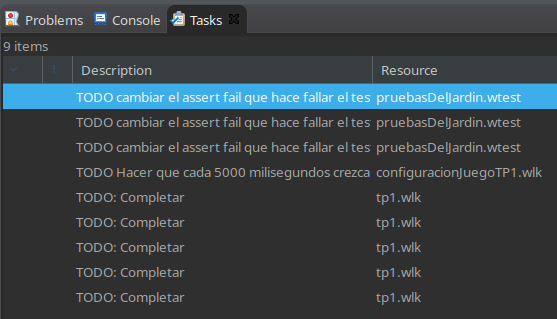
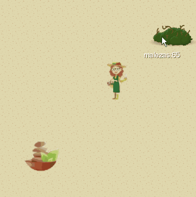

# Consigna TP1: Intro a Objetos

## Objetivos

- Definir métodos de consulta y efecto en los distintos objetos de dominio, evitando **abusar** del efecto.
- Abstraer y evitar repetir lógica.
- Poner en práctica las ideas de encapsulamiento, delegación y polimorfismo.
- Usar bloques para parametrizar comportamiento.
- Usar y definir tests automáticos para validar la lógica pedida.

## Tareas

Para que el TP se considere **completo** asegurate de:
- :dna: Completar la implementación de los **objetos de dominio** que están en `src/tp1/tp1.wlk`
- :test_tube: Completar los **tests sin implementar** que están en los archivos con extensión `.wtest` dentro de la carpeta `src/tp1`
- :video_game: Completar la **funcionalidad del juego** agregando la configuración del evento automático indicado en `src/tp1/configuracionJuegoTP1.wlk`

> :bulb: Dentro de los archivos a modificar notarás que están marcados distintos los métodos y tests incompletos con tareas pendientes (**TODO**) para encontrarlos con facilidad desde la vista de **Tareas** del IDE. Podés abrir esta vista desde el menú **Ventana -> Mostrar Vista** (se encuentra dentro de la categoría General).
> 
> 
>
> Esos comentarios pueden borrarse una vez que hayas completado lo que estaba pendiente, o dejarlos si te sirven cambiando la palabra **TODO** por **LISTO** así dejan de marcarse como cosas pendientes en la vista de tareas :wink:

**Importante!** Los métodos predefinidos en los objetos de dominio son los mínimos necesarios para ajustarse a los mensajes que se mandan
directamente desde los tests y el juego. De ninguna forma deberías limitarte a resolver **todo** en esos métodos únicamente, todo lo contrario!

Se espera que **delegues** y **abstraigas** adecuadamente para repartir lo mejor posible la solución entre los distintos objetos.

## Tareas opcionales

:microscope: Es recomendable definir tests adicionales que te ayuden a verificar mejor la lógica compleja de dominio en base a tu solución. Podés agregarlos en el archivo `*.wtest` que consideres más apropiado para la funcionalidad en cuestión. Para diferenciarlos fácilmente de las pruebas iniciales que se proveen, podés agregar un nuevo **describe** con el nombre que más te guste para agrupar esas pruebas nuevas :grin:

Los tests mínimos que se plantean en este trabajo están pensados para abarcar lo mejor posible la funcionalidad pedida sin comprometer la libertad para diseñar "de la puerta para adentro".

Sentite libre de agregar cualquier test más chiquito para la lógica interna que consideres importante y te sirva para validar cómo se comportan tus objetos individualmente con un mayor nivel de detalle.

----------

# Cuidando el Jardín :bouquet: :scissors:

Queremos hacer un juego en el cual podremos controlar a uno de dos personajes: **Olivia** o **Adriano**.

Cada personaje tiene formas distintas de trabajar sobre un **jardín** para mantener las malezas bajo control, pero el trabajo es desgastante! Para compensar, pueden atenderse en un **spa** que les ayudará a recuperarse para volver a trabajar :muscle:

Tenemos una implementación inicial de este juego que necesita completarse con la lógica que corresponda para cada personaje, el spa y el jardín para que el juego funcione correctamente.

Luego de completar todas las tareas, deberías poder ver tu trabajo en acción. Para probar el juego, ejecutá el programa que está en `src/tp1/juegoTP1.wpgm` con la opción **Ejecutar como -> Programa Wollok**. 

Con la barra espaciadora podés cambiar el personaje para controlar a Olivia o a Adriano. Al pasar con el mouse por encima del jardín deberías poder ver la cantidad de malezas que tiene en ese momento y cómo se actualiza automáticamente :star_struck:

Te dejamos una demo de cómo debería verse:

> :bulb: Todos los objetos de dominio se definen dentro del archivo `src/tp1/tp1.wlk`. En caso de que quieras hacer pruebas manuales desde la consola, podés ejecutar ese archivo desde el Repl para interactuar con los objetos mandándoles los mensajes que quieras.
>
> :rocket: Pro-Tip: Existe una forma de ejecutar solamente un test aislado, permitiendo visualizar el estado del sistema luego de su ejecución en el diagrama dinámico. Para ver cómo se hace, buscá el ejemplo **Ejecutar un solo test de un archivo** de la sección **Test Runner** [del Tour de Wollok](https://www.wollok.org/tour/). Sólo procurá dejar el test sin la palabra clave **only** luego de hacer la prueba, para que los otros tests de ese archivo vuelvan a ejecutarse :sweat_smile:

## Parte 1: Control de Malezas :herb:

En el jardín hay arbustos donde crecen malezas constantemente, y al pasar el tiempo tiende a quedar desprolijo por haber acumulado muchas malezas.

Inicialmente el jardín tiene 30 malezas. Cada vez que **crecen malezas**, se debe incrementar en 5 la cantidad de malezas del jardín.

Decimos que el jardín está **desprolijo** si tiene más de 20 malezas.

Por otro lado, necesitamos proveer algún mecanismo para **emprolijar** el jardín, lo cual dependerá del nivel de prolijidad con el cual se realize esta operación.

- Cuando se lo emprolija con un nivel de prolijidad mayor o igual a 10, el jardín queda sin malezas.
- Si el nivel de prolijidad se encuentra entre 3 y 9, la cantidad de malezas se reduce a la mitad.
- En cualquier otro caso no pasa nada.

### Wollok Game :video_game:

En el archivo `src/tp1/configuracionJuegoTP1.wlk` completá el método `configurarEventosAutomaticos()` para hacer que cada 5 segundos (5000 milisegundos) crezcan malezas en el jardín automáticamente cuando el programa se ejecute con su interfaz gráfica.

> :wink: Podés ayudarte viendo los ejemplos que están en la sección **Eventos automaticos** de la [documentación de **Wollok Game**](https://www.wollok.org/documentacion/conceptos/#game).

### Pruebas automáticas :test_tube:

Para que el ejercicio esté completo, más allá de implementar lo pedido en el archivo `src/tp1/tp1.wlk`, deben pasar los tests unitarios que se proveen en `src/tp1/tp1_parte1.wtest` dentro del grupo `"Control de Malezas"`.

Además **deben implementarse** los siguientes tests (que van a fallar siempre porque están incompletos):
- Al emprolijarlo con un nivel de prolijidad alto, queda sin malezas
- Al emprolijarlo con un nivel de prolijidad intermedio, las malezas bajan a la mitad
- Al emprolijarlo con un nivel de prolijidad bajo, no se reducen las malezas

## Parte 2: Olivia y el Jardín :bouquet:

De Olivia conocemos qué tan relajada está mediante su nivel de relax que inicialmente es 4, el cual baja cuando trabaja porque se estresa.

Cuando Olivia **trabaja en un jardín**:
- si el jardín está desprolijo al iniciar el trabajo se estresa dos puntos,
- luego lo emprolija con un nivel de prolijidad equivalente al doble de su relax actual,
- finalmente siempre se estresa un punto más.

Estresarse implica disminuir su nivel de relax en la cantidad de puntos indicados, teniendo en cuenta que el mínimo valor de relax que puede tener es 1.

> :bulb: Los números de Wollok entienden el mensaje `max(otroNumero)` que puede ser de utilidad para calcular el nivel de relax que debería tener Olivia luego de estresarse.

### Pruebas automáticas :test_tube:

Para que el ejercicio esté completo deben pasar los tests unitarios que se proveen en `src/tp1/tp1_parte2.wtest` dentro del grupo `"Olivia y el Jardín"`.

## Parte 3: Adriano y el Jardín :scissors:

De Adriano conocemos qué tan contracturado está. Inicialmente no tiene contracturas, pero a medida que trabaja sus contracturas aumentan.

Cuando Adriano **trabaja en un jardín**, lo emprolija con un nivel de prolijidad de 1 si está lastimado, o de 5 si no lo está. Está lastimado cuando tiene más de 10 contracturas.

Al finalizar el trabajo sus contracturas aumentan en el mínimo entre 7 y la cantidad de malezas que tenía el jardín **antes** de que Adriano lo emprolijara.

> :bulb: Los números de Wollok entienden el mensaje `min(otroNumero)` que puede ser de utilidad para calcular las contracturas que debería generarle el trabajo a Adriano.

### Pruebas automáticas :test_tube:

Para que el ejercicio esté completo deben pasar los tests unitarios que se proveen en `src/tp1/tp1_parte3.wtest` dentro del grupo `"Adriano y el Jardín"`.

## Parte 4: Atenciones en el Spa :bamboo:

Para cerrar, necesitamos que Olivia y Adriano puedan atenderse en el spa. Cuando el spa atiende una persona pasan tres cosas:

1. la persona se da un baño de vapor durante 5 minutos,
2. luego recibe masajes,
3. luego se da otro baño de vapor durante 15 minutos.

Sabemos que:

* cuando Olivia **recibe masajes**, su nivel de relax aumenta en 3 puntos.
* cuando Olivia **se da un baño de vapor**, su nivel de relax aumenta 1 punto cada 5 minutos que dura el baño de vapor.
* cuando Adriano **recibe masajes**, sus contracturas disminuyen en 5 (teniendo en cuenta que el valor final no quede por debajo de 0).
* cuando Adriano **se da un baño de vapor**, sólo si está lastimado sus contracturas disminuyen en 2, independientemente de la duración del baño.

### Pruebas automáticas :test_tube:

Para que el ejercicio esté completo deben pasar los tests unitarios que se proveen en `src/tp1/tp1_parte4.wtest` dentro del grupo `"Atenciones en el Spa"`.
